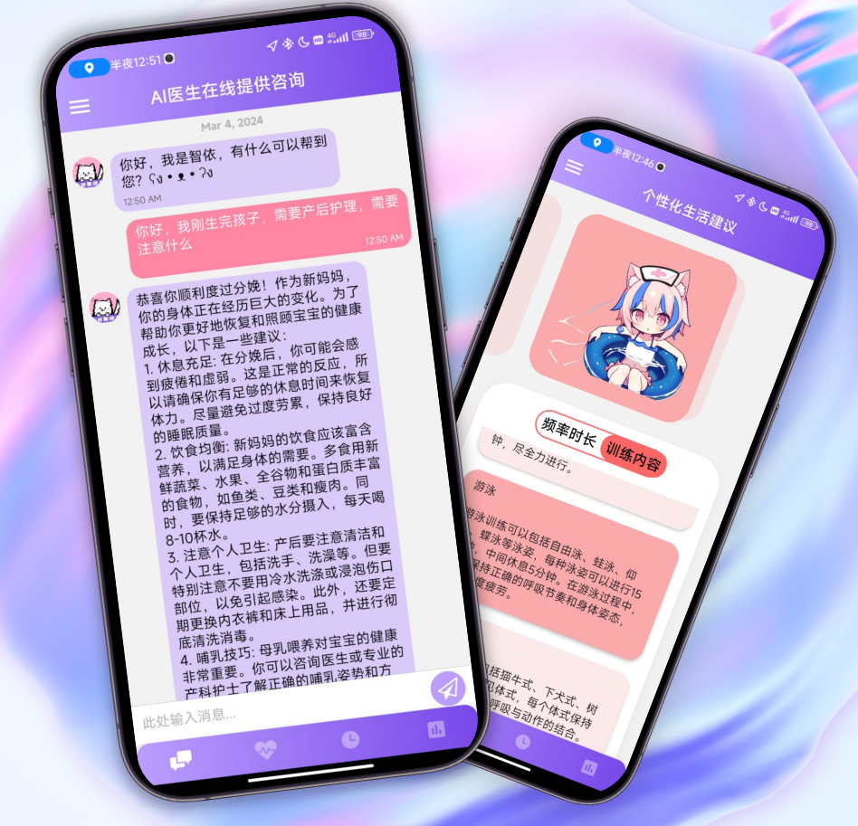

# 医问通

## 介绍

医智通是一款在医疗领域具有创新性的应用，集成了我们基于多个业内先进水平的开发的多模态大模型能力。通过自研的多模态大模型，医智通能够同时处理文字、图像、声音等多种形式的医疗数据，实现更全面、准确的医疗分析和诊断。这使得医智通在医疗诊断、健康管理等方面具有显著优势，为用户提供全面、便捷的医疗服务体验。以创新的技术和多模态大模型能力为支撑，医智通致力于推动医疗领域的发展，提升医疗服务质量，为用户提供准确、个性化的医疗解决方案。

## UI 与 视频

<video src="./assets/videos/视频1.mp4" width="100%" height="350" controls></video>
